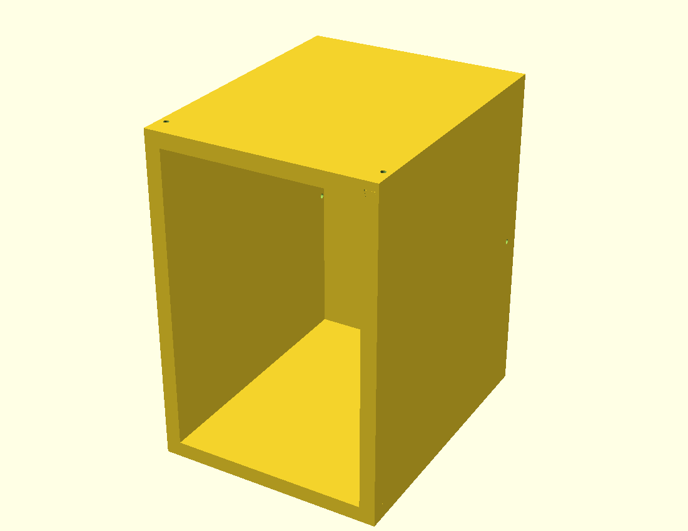
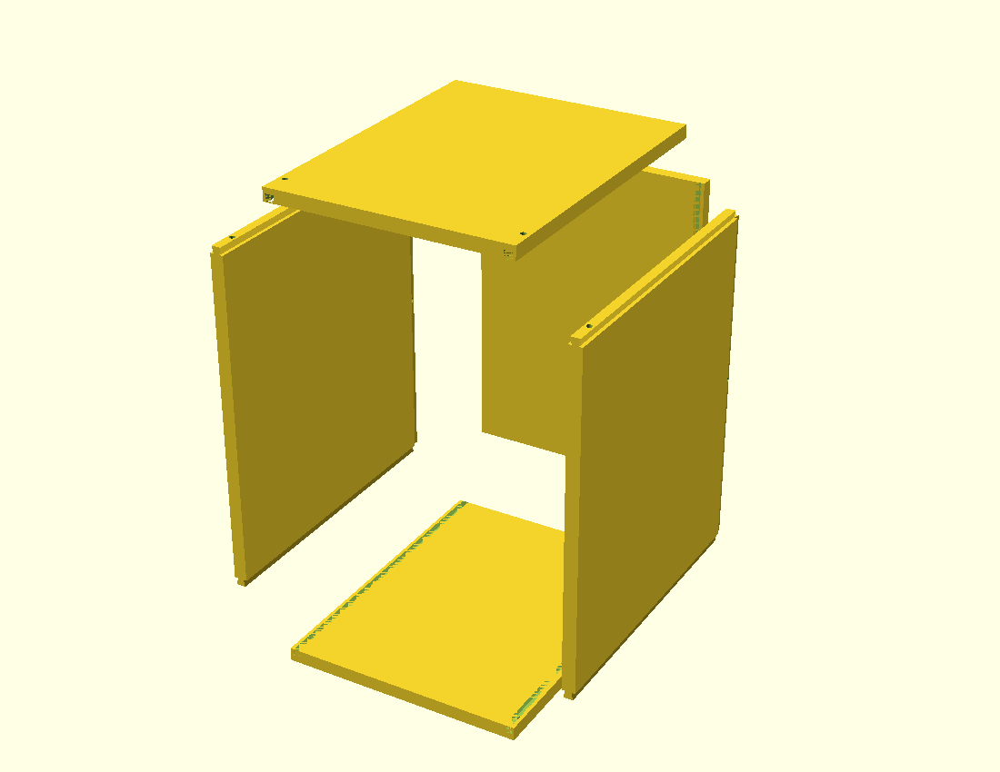
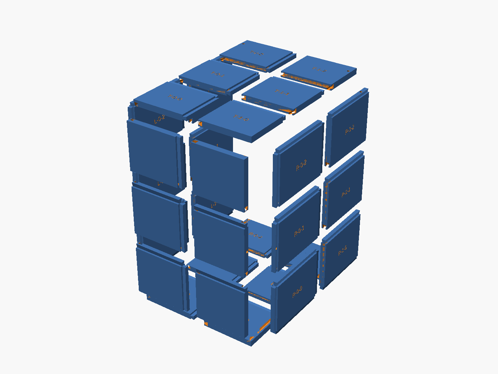

# Tennis-Ball-Machine Locker

A parametric, 3D-printable **open-front locker** sized to hold a tennis ball
machine of **39.2 × 27.1 × 44.8 cm** (D×W×H) with **≥1″ clearance on every
interior face**, built from **20 mm (~0.8″) thick panels** (lightweight variant —
plenty for 20 lb; set `wall=25.4` for the full 1″ version) and rated to carry
the **20 lb** machine.

Because no single panel fits a desktop printer, every panel is **automatically
split into bed-sized tiles** that re-join with **full-length sliding dovetails**.
The five panels (bottom, top, back, two sides) meet at the corners with
**sliding-dovetail housing joints + locking pins**.

Everything is generated from one parametric file: [`src/locker.scad`](src/locker.scad).




Tile-level exploded view — all 30 printable tiles fanned apart along their
sliding-dovetail seams, with the engraved `PANEL-col-row` sort labels visible:



---

## Which tool should I use? → OpenSCAD

| Tool | Verdict for this job |
|------|----------------------|
| **OpenSCAD** ✅ | **Recommended & used here.** The whole design is math: exact dovetail angles, automatic bed-aware tiling, and tolerance fits are all *parameters*. Change the printer or the machine size and the model re-tiles itself. Plain-text → version-controllable in git. |
| **Fusion 360** | Excellent and a fine alternative if you prefer a GUI and want to tweak fillets/aesthetics by hand. But the panel-splitting and 36 dovetail seams would be tedious manual work, and it's not as cleanly version-controlled. Good for *importing* these STLs to validate fit. |
| **Meshy.ai** | ❌ Not suitable. It generates *organic* meshes from text/images and is not dimensionally precise — it cannot hold the ±0.35 mm joint tolerances that make sliding dovetails actually slide and lock. |

---

## Dimensions

| | Width (X) | Depth (Y) | Height (Z) |
|---|---|---|---|
| Object | 271 mm | 392 mm | 448 mm |
| **Interior** (object + 1″ each side) | **321.8** | **442.8** | **498.8** |
| **Exterior** | **361.8** | **462.8** | **538.8** |

- Wall thickness: **20 mm (~0.8″)**
- Front (+Y) is **fully open** so the machine slides straight in.
- Target printer: **Bambu Lab P2S, 256 × 256 × 256 mm** (`print_env` parameter).

## Tile map (30 printable parts)

| Panel | Grid | Tiles | Approx. tile size (mm) |
|-------|------|-------|------------------------|
| bottom | 2 × 3 | 6 | 181 × 154 × 20 |
| top    | 2 × 3 | 6 | 181 × 154 × 20 |
| back   | 2 × 3 | 6 | 181 × 166 × 20 |
| left   | 2 × 3 | 6 | 221 × 166 × 20 |
| right  | 2 × 3 | 6 | 221 × 166 × 20 |

Sliding-dovetail tongues add ≤14 mm to one or two edges of a tile; all parts
(incl. tongues) stay inside the ~236 mm usable bed.

**Sort labels:** each tile is engraved (1 mm deep) with `PANEL-col-row`, e.g.
`L-0-1`, on the face that prints upward. Panel codes: **B**=bottom, **T**=top,
**K**=back, **L**=left, **R**=right. Toggle with `labels`, size via
`label_size`/`label_depth`.

---

## Generating the parts

OpenSCAD ≥ 2021 required.

```bash
# preview the whole locker / exploded view in the GUI
openscad src/locker.scad                       # then set `mode` in the customizer

# export every printable tile to ./stl  (headless-safe)
./export_stls.sh
```

Render a single thing from the command line by overriding parameters with `-D`:

```bash
# one tile
openscad -o stl/left_0_0.stl -D 'mode="tile"' -D 'which="left"' -D 'ti=0' -D 'tj=0' src/locker.scad
# a whole (un-split) panel, for reference
openscad -o ref/left.stl     -D 'mode="panel"' -D 'which="left"' src/locker.scad
```

`mode` values: `assembled`, `exploded`, `exploded_tiles`, `panel`, `tile`, `alltiles`.
(`exploded` separates the 5 panels; `exploded_tiles` additionally fans each
panel's print tiles apart along their dovetail seams — gap set by `tile_explode`.)

---

## Print settings (functional, 20 lb load)

- **Material:** PETG or PLA+ (PETG for garage/outdoor temperatures). ASA if UV-exposed.
- **Walls:** 4–5 perimeters. **Infill:** 15–20 % gyroid is ample for 20 lb across 1″ panels.
- **Layer height:** 0.2–0.28 mm.
- **Orientation:** print each tile **flat** (largest face on the bed). The dovetail
  undercuts are shallow (~11–14° from vertical) and print cleanly without supports.
- The bottom-panel tiles carry the load — don't skimp on their perimeters.

**Filament estimate:** ~19,000 cm³ of panel volume → roughly **4.5–6.5 kg** of
filament at 15–20 % infill (the lightweight 20 mm variant). Still a multi-day,
multi-spool project. `wall` is a parameter — raise it to 25.4 for full 1″ panels
or lower it further; the model re-tiles and re-joins automatically.

## Hardware

- **Locking pins:** 8 mm dowels or M8 bolts. Holes are pre-modelled (`pin_d`,
  `pin_clr`) through every slid corner joint.
- Optional CA glue or epoxy in the **tile** sliding dovetails for a permanent
  panel; leave the **corner** joints pinned-but-unglued if you want to disassemble.

---

## Assembly order

1. **Build each panel** from its tiles: slide neighbouring tiles together along
   their dovetail seams (a few taps with a mallet; add glue if permanent).
2. **Bottom** flat on the bench.
3. **Slide both side panels** onto the bottom, front-to-back, engaging the
   Y-running dovetails in the bottom's top face.
4. **Drop the back panel** down so its two inner-face vertical dovetail grooves
   engage the rear-edge tenons of the two side panels.
5. **Slide the top** on front-to-back onto the side top tenons.
6. **Insert the 8 mm pins** through each corner joint to lock everything home.

---

## Key parameters (`src/locker.scad`)

| Parameter | Meaning | Default |
|-----------|---------|---------|
| `object` | machine [Depth, Width, Height] | `[392, 271, 448]` |
| `clearance` | free space per interior side | `25.4` (1″) |
| `wall` | panel thickness | `20` (lightweight) |
| `print_env` | printer build volume | `[256,256,256]` (P2S) |
| `dt_*` | tile sliding-dovetail size & fit | depth 14, fit 0.35 |
| `mj_*` | corner sliding-dovetail size & fit | depth 11, fit 0.40 |
| `pin_d` | locking pin diameter | 8 |

Change any of these and the part count, tile sizes, and joints all update
automatically. Tune `dt_fit`/`mj_fit` to your printer (smaller = tighter slide).
